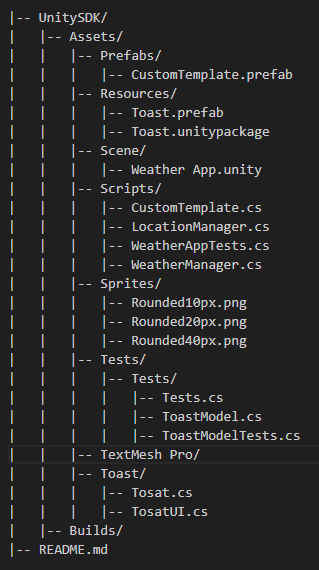
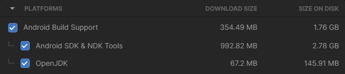
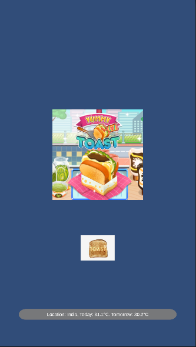
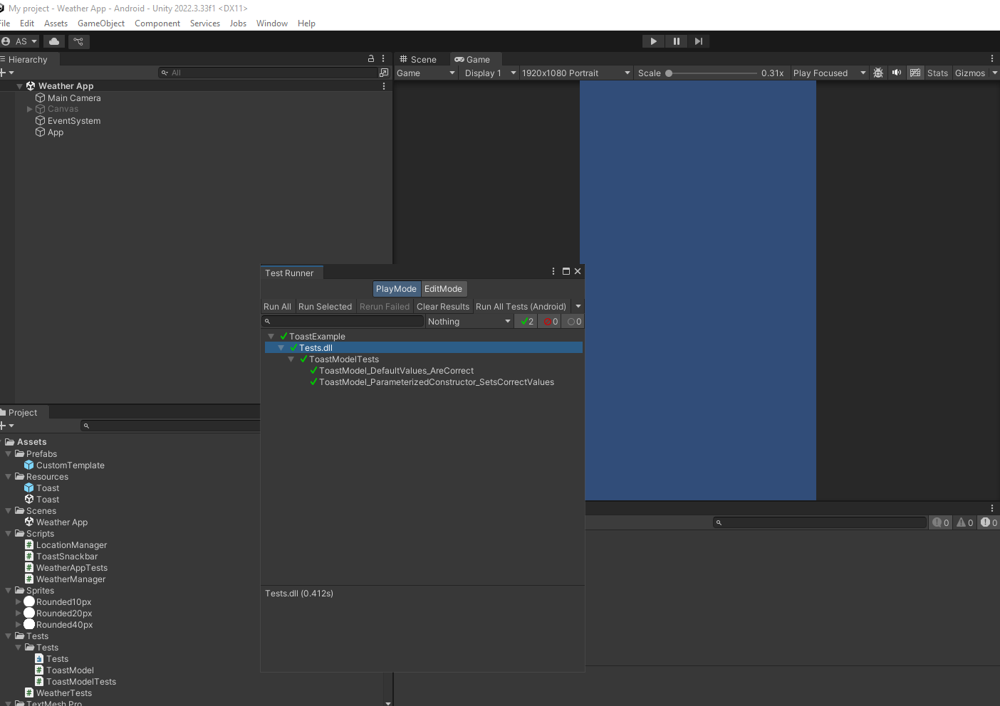

________________________________________________________________________________

# Unity SDK for Toast Messages and Weather App

## Overview

This project consists of a Unity SDK for displaying toast messages and a Weather App that retrieves the user's location and displays weather data using the Open-Meteo API. The SDK provides customizable toast messages that can be integrated into Unity applications, while the Weather App utilizes location services and external APIs to fetch and display weather updates. 

## Features

Toast Message SDK

- Displays toast messages with customizable text, duration, and position. In this case capture the Latitude and Longitude of the user and show the current and tomorrow temperature of the location of the user.

- Supports a queue system to handle multiple toasts.

- Uses Unity's UI system for seamless integration.

## Weather App

- Retrieves weather data from Open-Meteo API.

- Fetches user's location using OpenStreetMap's Nominatim API.

- Displays weather updates using the Toast SDK.

- Includes a customizable UI template.

## Project Structure

## Installation

1. Clone or download this repository.

2. Unzip MyProject.zip file

3. Open the project in Unity Version 2022.3.33f1. If you want to make Android builds select while installation 

  Ensure the required dependencies as TextMeshPro are installed.
  
  Install TextMeshPro both packages by navigating to:
  - Window > TextMeshPro > Import TMP Essential Resources and.
  - Window > TextMeshPro > Import TMP Examples and Extras (Figure 01).

4. Open "Weather App" Unity scene, Game "Display 1" (1080x1920) or Simulator mode

5. Import the `Toast.unitypackage` into your Unity Project. **Go to Assets** > **Import Package** > **Custom Package**. 

## Usage

Toast Messages

Toast.Show($"Location: {location}, {weatherReportToday}, {weatherReportTomorrow}");

Looks like : "Location: India, Today: 31.1°C, Tomorrow: 30.2°C"

## Weather App

1. Attach WeatherManager.cs to a GameObject.

2. Assign CustomTemplate from the Prefabs folder.

3. Run the game or Build & Run to test it directly to your Android device.

## API References

- Open-Meteo API [here](https://open-meteo.com/en/docs#api-documentation).

- OpenStreetMap Nominatim [here](https://nominatim.openstreetmap.org/reverse?format=json).

## Android Instructions

Android is in Builds folder or into your Unity Project  **File** > **Build Settings** > **Build and Run**. Make sure you have changed platform for Android and after that Build & Run which will load the apk onto your device. This assumes that your phone is already in developer mode and has been recognized by your computer as such. For more inforamtion and setup look here: [here](http://docs.unity3d.com/Manual/android-sdksetup.html)

## Known Issues

Ensure network connectivity for API calls.

Location retrieval may fail due to API limits.

## Unit tests for Unity Package contains Toast logic for messages

- tests are implement in "Tests" forlder ot the Unity project
- result in main folder "ToastModelTest" 

## Author

Developed by Aneta Spasova.

